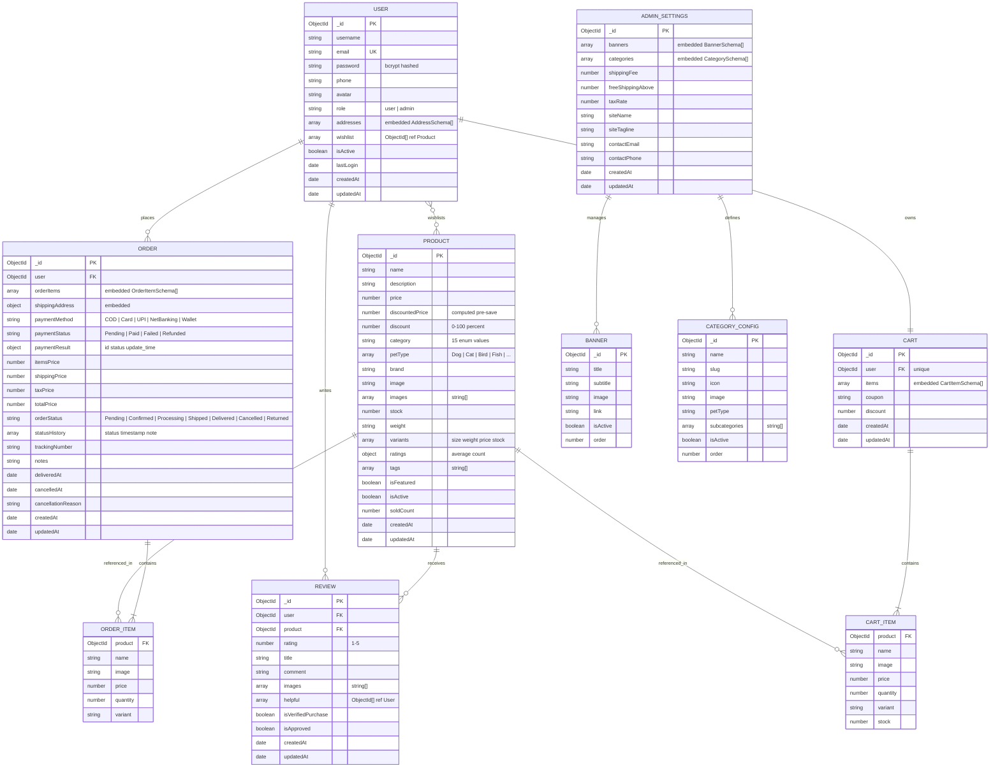

# Entity Relationship (ER) Diagram

This document details the complete database schema and relationship designs for the **PetPaws** e-commerce system. All collections are stored in MongoDB and modelled via Mongoose ODM.

---

## ER Diagram



---

## Schema Definitions

### 1. User Schema

Stores authentication credentials, profile information, saved delivery addresses, and the wishlist of bookmarked products.

```javascript
// models/User.js
const addressSchema = new mongoose.Schema({
    fullName:     { type: String, required: true },
    phone:        { type: String, required: true },
    addressLine1: { type: String, required: true },
    addressLine2: { type: String, default: '' },
    city:         { type: String, required: true },
    state:        { type: String, required: true },
    pincode:      { type: String, required: true },
    country:      { type: String, default: 'India' },
    isDefault:    { type: Boolean, default: false },
});

const userSchema = new mongoose.Schema({
    username: { type: String, required: true, trim: true, minlength: 3 },
    email:    { type: String, required: true, unique: true, lowercase: true },
    password: { type: String, required: true, minlength: 6, select: false },
    phone:    { type: String, default: '' },
    avatar:   { type: String, default: '' },
    role:     { type: String, enum: ['user', 'admin'], default: 'user' },
    addresses: [addressSchema],
    wishlist:  [{ type: mongoose.Schema.Types.ObjectId, ref: 'Product' }],
    isActive:  { type: Boolean, default: true },
    lastLogin: { type: Date },
}, { timestamps: true });
```

**Key design notes:**
- `email` is indexed as `unique: true` to prevent duplicate registrations.
- `password` has `select: false` — it is never returned in API responses unless explicitly selected.
- Passwords are hashed using bcryptjs in a `pre('save')` hook before persisting.
- A `comparePassword()` instance method is defined for authentication.

---

### 2. Product Schema

Represents every pet product available on the platform — food, toys, accessories, grooming, supplements, and more.

```javascript
// models/Product.js
const productSchema = new mongoose.Schema({
    name:           { type: String, required: true, trim: true },
    description:    { type: String, required: true },
    price:          { type: Number, required: true, min: 0 },
    discountedPrice:{ type: Number, default: 0 },
    discount:       { type: Number, default: 0, min: 0, max: 100 },
    category: {
        type: String, required: true,
        enum: ['Dog Food','Cat Food','Bird Food','Fish Food','Small Animal Food',
               'Dog Accessories','Cat Accessories','Toys','Grooming',
               'Health & Supplements','Cages & Habitats','Beds & Furniture',
               'Leashes & Collars','Clothing & Apparel','Other']
    },
    petType:   { type: [String], enum: ['Dog','Cat','Bird','Fish','Rabbit','Hamster','Reptile','All'] },
    brand:     { type: String, default: '' },
    image:     { type: String, default: '' },
    images:    [{ type: String }],
    stock:     { type: Number, required: true, min: 0 },
    weight:    { type: String, default: '' },
    variants:  [{ size: String, weight: String, price: Number, stock: Number }],
    ratings:   { average: { type: Number, default: 0 }, count: { type: Number, default: 0 } },
    tags:      [String],
    isFeatured:{ type: Boolean, default: false },
    isActive:  { type: Boolean, default: true },
    soldCount: { type: Number, default: 0 },
}, { timestamps: true });

// Full-text search index
productSchema.index({ name: 'text', description: 'text', brand: 'text', tags: 'text' });

// Auto-compute discounted price
productSchema.pre('save', function(next) {
    if (this.discount > 0)
        this.discountedPrice = Math.round(this.price - (this.price * this.discount / 100));
    else
        this.discountedPrice = this.price;
    next();
});
```

**Key design notes:**
- `category` and `petType` use enum validation to enforce domain-specific values.
- A **compound text index** on `name`, `description`, `brand`, and `tags` enables MongoDB full-text `$text` search queries.
- `isActive: false` is used for soft-deletion to preserve integrity of historical order records.
- `soldCount` is incremented atomically on order placement and decremented on cancellation.

---

### 3. Order Schema

Stores the complete lifecycle of every customer purchase including item details, shipping, payment, and status history.

```javascript
// models/Order.js
const orderSchema = new mongoose.Schema({
    user:        { type: mongoose.Schema.Types.ObjectId, ref: 'User', required: true },
    orderItems:  [orderItemSchema],
    shippingAddress: shippingAddressSchema,
    paymentMethod:   { type: String, enum: ['COD','Card','UPI','NetBanking','Wallet'], default: 'COD' },
    paymentStatus:   { type: String, enum: ['Pending','Paid','Failed','Refunded'], default: 'Pending' },
    paymentResult:   { id: String, status: String, update_time: String },
    itemsPrice:    { type: Number, required: true },
    shippingPrice: { type: Number, required: true },
    taxPrice:      { type: Number, required: true },
    totalPrice:    { type: Number, required: true },
    orderStatus: {
        type: String,
        enum: ['Pending','Confirmed','Processing','Shipped','Delivered','Cancelled','Returned'],
        default: 'Pending'
    },
    statusHistory: [{ status: String, timestamp: { type: Date, default: Date.now }, note: String }],
    trackingNumber: { type: String, default: '' },
    deliveredAt:    { type: Date },
    cancelledAt:    { type: Date },
    cancellationReason: { type: String, default: '' },
}, { timestamps: true });
```

**Key design notes:**
- `orderItems` are **embedded** (not referenced) so that a product's name and price at the time of purchase are permanently preserved even if the product is later edited.
- `statusHistory` is an append-only array that records every state transition with a timestamp and optional admin note.
- Order cancellation is only allowed when `orderStatus` is `Pending` or `Confirmed`. Stock is restored atomically on cancellation.

---

### 4. Cart Schema

Maintains a persistent, single shopping cart per user.

```javascript
// models/Cart.js
const cartSchema = new mongoose.Schema({
    user:  { type: mongoose.Schema.Types.ObjectId, ref: 'User', required: true, unique: true },
    items: [cartItemSchema],
    coupon:   { type: String, default: '' },
    discount: { type: Number, default: 0 },
}, { timestamps: true });
```

**Key design notes:**
- `user` has `unique: true` — every user has exactly one cart document.
- Cart items store a snapshot of `price` at the time of addition. If the product's price changes, the cart retains the price at which it was added.
- Inactive (`isActive: false`) products are filtered out of the cart on every fetch.
- The cart is automatically cleared after a successful order placement.

---

### 5. Review Schema

Stores customer product reviews linked to both a user and a product.

```javascript
// models/Review.js
const reviewSchema = new mongoose.Schema({
    user:    { type: mongoose.Schema.Types.ObjectId, ref: 'User', required: true },
    product: { type: mongoose.Schema.Types.ObjectId, ref: 'Product', required: true },
    rating:  { type: Number, required: true, min: 1, max: 5 },
    title:   { type: String, required: true, trim: true },
    comment: { type: String, required: true },
    images:  [String],
    helpful: [{ type: mongoose.Schema.Types.ObjectId, ref: 'User' }],
    isVerifiedPurchase: { type: Boolean, default: false },
    isApproved:         { type: Boolean, default: true },
}, { timestamps: true });

// One review per user per product
reviewSchema.index({ user: 1, product: 1 }, { unique: true });
```

**Key design notes:**
- A **compound unique index** on `(user, product)` prevents duplicate reviews.
- `isVerifiedPurchase` is automatically set to `true` when a delivered order containing the reviewed product is found in the database.
- After each review addition or deletion, the product's `ratings.average` and `ratings.count` are recomputed and saved.

---

### 6. Admin Schema

Stores site-wide configuration managed through the admin settings panel.

```javascript
// models/Admin.js
const adminSettingsSchema = new mongoose.Schema({
    banners:           [bannerSchema],
    categories:        [categorySchema],
    shippingFee:       { type: Number, default: 50 },
    freeShippingAbove: { type: Number, default: 500 },
    taxRate:           { type: Number, default: 5 },
    siteName:          { type: String, default: 'PetPaws' },
    siteTagline:       { type: String, default: 'Everything your pet needs' },
    contactEmail:      { type: String, default: 'support@petpaws.com' },
    contactPhone:      { type: String, default: '+91-9999999999' },
}, { timestamps: true });
```

**Key design notes:**
- There is a single `AdminSettings` document in the database. Controllers use `findOne()` and create it if absent.
- `shippingPrice` in order controllers is computed dynamically: `itemsTotal >= freeShippingAbove ? 0 : shippingFee`.
- `taxPrice` = `Math.round(itemsPrice * taxRate / 100)`.

---

## Collection Relationship Summary

| Relationship | Type | Description |
| :--- | :--- | :--- |
| User → Order | One-to-Many | A user can place many orders |
| User → Cart | One-to-One | Each user owns exactly one cart |
| User → Review | One-to-Many | A user can write many reviews |
| User → Product (wishlist) | Many-to-Many | Users can bookmark many products |
| Product → Review | One-to-Many | A product can receive many reviews |
| Product → OrderItem | One-to-Many | A product can appear in many order items |
| Product → CartItem | One-to-Many | A product can appear in many cart items |
| Order → OrderItem | One-to-Many (embedded) | An order contains many order items |
| Cart → CartItem | One-to-Many (embedded) | A cart contains many cart items |

---

[◄ Back to Project Architecture](../project_architecture.md) | [Back to Home](../README.md)
