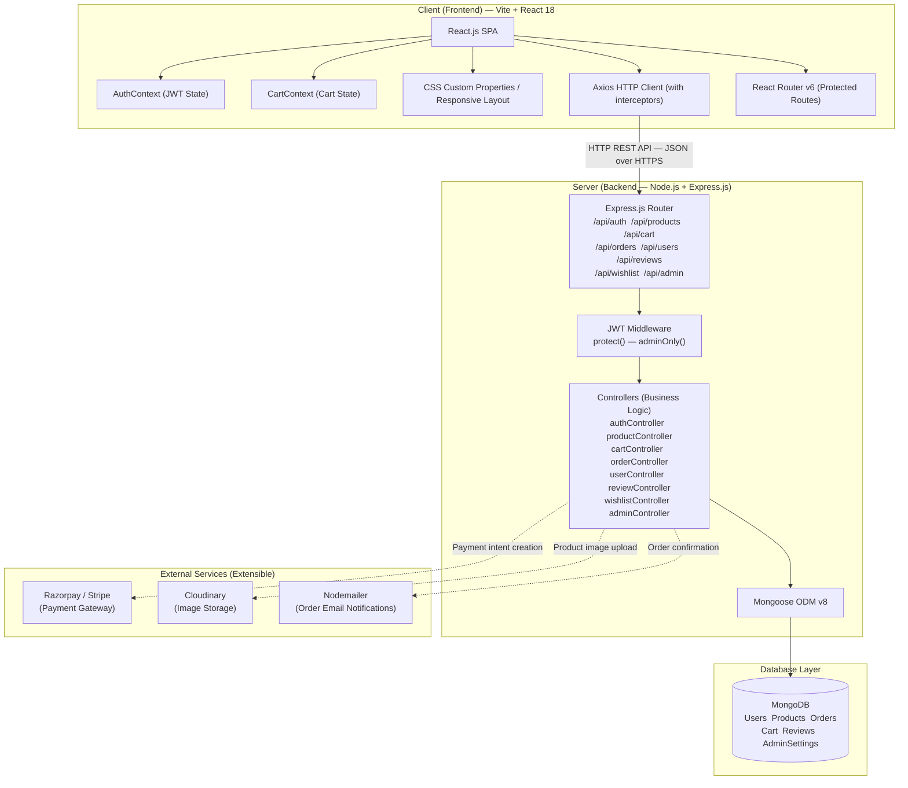

# Technical Architecture

This document describes the complete technical architecture of the **PetPaws** MERN Stack E-Commerce application, covering all system layers from the React SPA to the MongoDB database and external service integrations.

---

## System Architecture Diagram



---

## Architectural Layers

### 1. Presentation Layer (Client-Side)

| Component | Technology | Purpose |
| :--- | :--- | :--- |
| SPA Framework | React 18 | Component-based UI rendering |
| Build Tool | Vite 5 | Fast dev server with HMR, proxy support |
| Routing | React Router v6 | Declarative client-side navigation + protected routes |
| Auth State | AuthContext + localStorage | Global user session management via JWT |
| Cart State | CartContext | Real-time cart count, total, and item management |
| HTTP Client | Axios | REST API calls with automatic JWT header injection |
| Styling | CSS Custom Properties | Design token system for consistent theming |
| Notifications | react-hot-toast | Non-blocking toast alerts |
| Icons | react-icons (Feather) | Lightweight SVG icon set |

**Key Client Design Decisions:**

- **Axios Interceptors**: A request interceptor reads the JWT from `localStorage` and attaches it as `Authorization: Bearer <token>` on every outgoing request. A response interceptor globally handles `401 Unauthorized` by clearing the token and redirecting to `/login`.
- **Protected Routes**: A `<ProtectedRoute>` wrapper component checks `AuthContext` before rendering private pages. An `adminOnly` prop additionally validates the `user.role === 'admin'` condition.
- **Vite Proxy**: All `/api/*` requests from the dev server are proxied to `http://localhost:8000`, eliminating CORS issues during development.

---

### 2. Router & Middleware Layer

| Component | Technology | Purpose |
| :--- | :--- | :--- |
| HTTP Framework | Express.js 4 | REST API routing and middleware chaining |
| CORS | cors npm package | Allows cross-origin requests from the React client |
| Body Parsing | express.json() | Parses incoming JSON request bodies |
| JWT Verification | protect middleware | Decodes and validates JWT; attaches `req.user` |
| Role Authorization | adminOnly middleware | Restricts admin routes to `role === 'admin'` users |
| Static Files | express.static | Serves uploaded images from `/uploads` directory |

**Mounted API Routes:**

```
/api/auth       →  authRoutes.js
/api/products   →  productRoutes.js
/api/cart       →  cartRoutes.js
/api/orders     →  orderRoutes.js
/api/users      →  userRoutes.js
/api/reviews    →  reviewRoutes.js
/api/wishlist   →  wishlistRoutes.js
/api/admin      →  adminRoutes.js
/api/categories →  categoryRoutes.js
/api/health     →  Health check endpoint
```

---

### 3. Controller & Business Logic Layer

Controllers are pure Express handler functions (`async (req, res) => {}`) that:

1. Read validated input from `req.body`, `req.params`, or `req.query`
2. Interact with Mongoose models to perform database operations
3. Apply business rules (stock validation, price computation, role checks)
4. Return structured JSON responses with appropriate HTTP status codes

| Controller | Key Responsibilities |
| :--- | :--- |
| `authController` | Registration, login, token generation, profile retrieval |
| `productController` | Product CRUD, search with text index, featured/related products |
| `cartController` | Add/update/remove items, stock validation per item |
| `orderController` | Order creation with stock deduction, status lifecycle management |
| `userController` | Profile updates, password change, address CRUD |
| `reviewController` | Review submission, rating aggregation, verified purchase detection |
| `wishlistController` | Wishlist toggle, move-to-cart functionality |
| `adminController` | Dashboard aggregation pipeline, banner/category/settings management |

---

### 4. Data Access Layer

| Component | Technology | Purpose |
| :--- | :--- | :--- |
| ODM | Mongoose 8 | Schema definition, validation, query generation, hooks |
| Database | MongoDB | Document store in BSON format |
| Indexing | Text index on Product | Full-text search across name, description, brand, tags |
| Aggregation | MongoDB aggregation pipeline | Admin dashboard revenue charts and top-products analytics |

**Mongoose Models Defined:**

```
User.js           —  Authentication, addresses, wishlist
Product.js        —  Pet product catalog with petType + category enums
Order.js          —  Full order lifecycle with statusHistory array
Cart.js           —  Per-user cart with embedded items
Review.js         —  Star ratings with compound unique index (user, product)
Admin.js          —  AdminSettings: banners, categories, shipping/tax config
```

---

### 5. Security Architecture

```
[Request] ──► CORS Check ──► Rate Limit ──► Body Parse
              ──► protect() [JWT verify → req.user populated]
              ──► adminOnly() [role check, admin routes only]
              ──► Controller Handler
              ──► [Response]
```

- **Password Hashing**: bcryptjs with salt rounds 10, applied in a Mongoose `pre('save')` hook — never stored in plain text.
- **JWT Tokens**: Signed with `process.env.JWT_SECRET`, expire in `7d` (configurable). Carried in the `Authorization` header — not cookies — for SPA compatibility.
- **Soft Deletes**: Products are never hard-deleted; `isActive: false` is set to preserve order history references.
- **Stock Locking**: Stock is validated and decremented atomically within the `createOrder` controller before any payment confirmation is assumed.

---

## Environment Configuration

```env
# server/.env
PORT=8000
MONGO_URI=mongodb://localhost:27017/petpaws
JWT_SECRET=your_super_secret_jwt_key_here
JWT_EXPIRE=7d
NODE_ENV=development
```

---

## Deployment Architecture (Production)

```
┌─────────────────┐       ┌──────────────────────┐       ┌─────────────────┐
│   Vercel / CDN  │       │  Railway / Render    │       │  MongoDB Atlas  │
│                 │ HTTPS │                      │       │                 │
│  React Build    │──────►│  Node.js + Express   │──────►│  Cloud Database │
│  (Static Files) │       │  (Server Process)    │       │  (Managed)      │
└─────────────────┘       └──────────────────────┘       └─────────────────┘
```

---

[◄ Back to Project Architecture](../project_architecture.md) | [Back to Home](../README.md)
