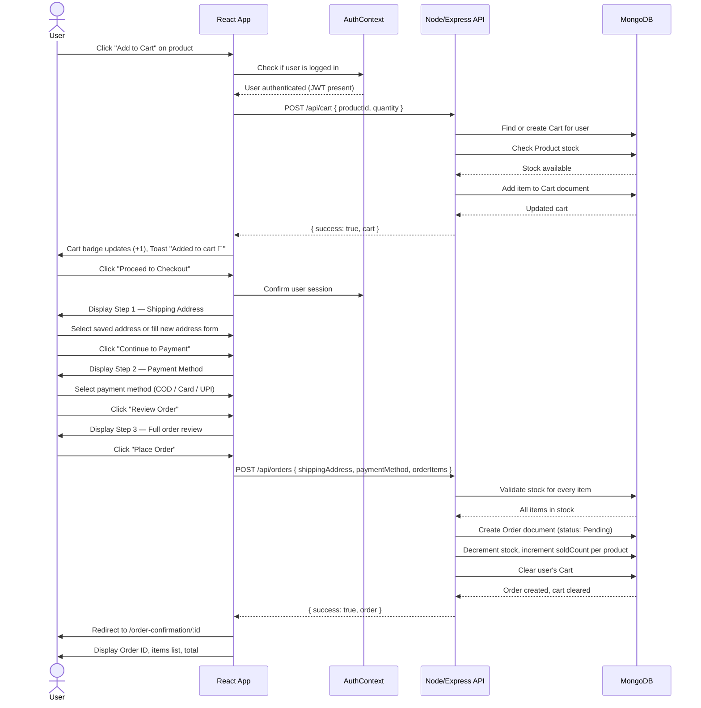
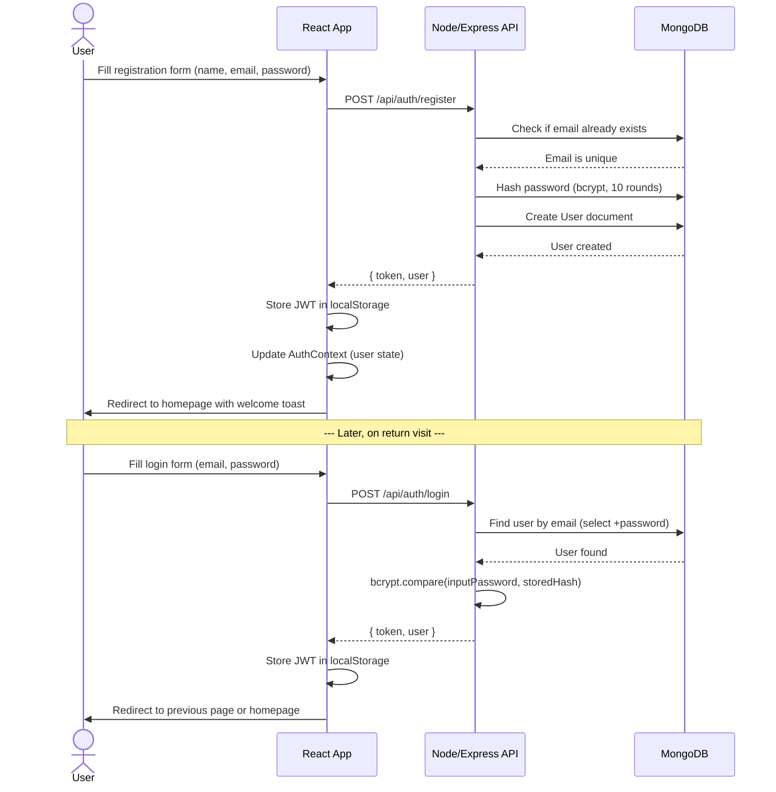
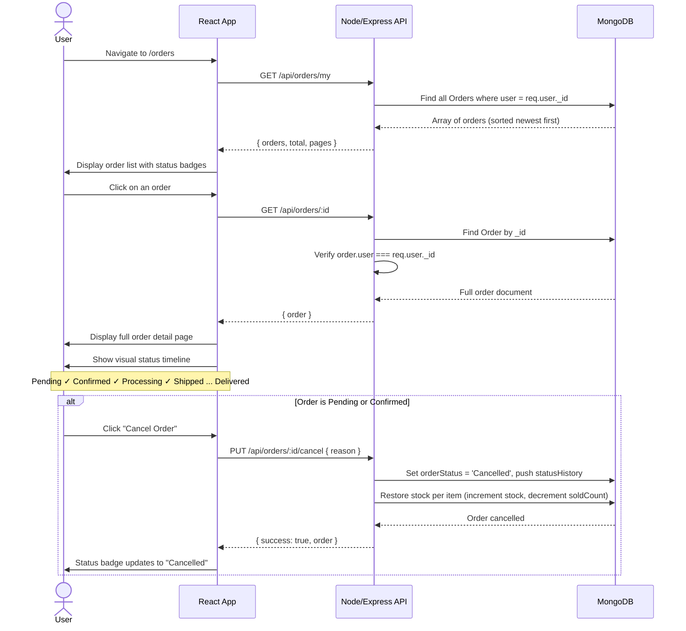
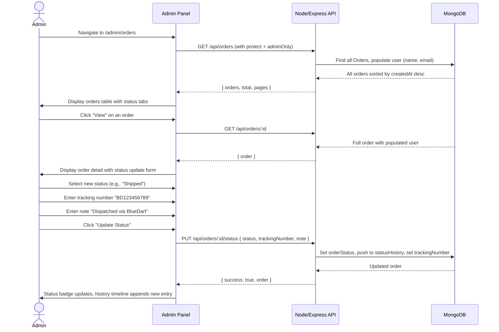
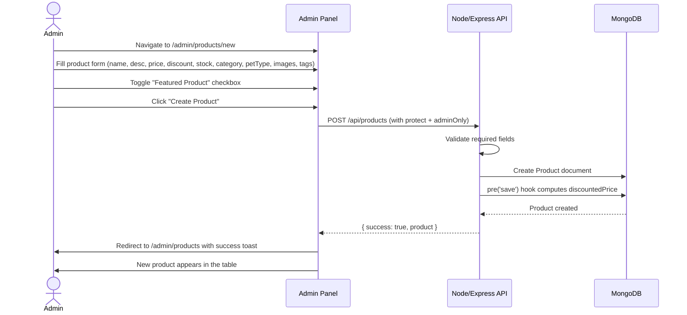
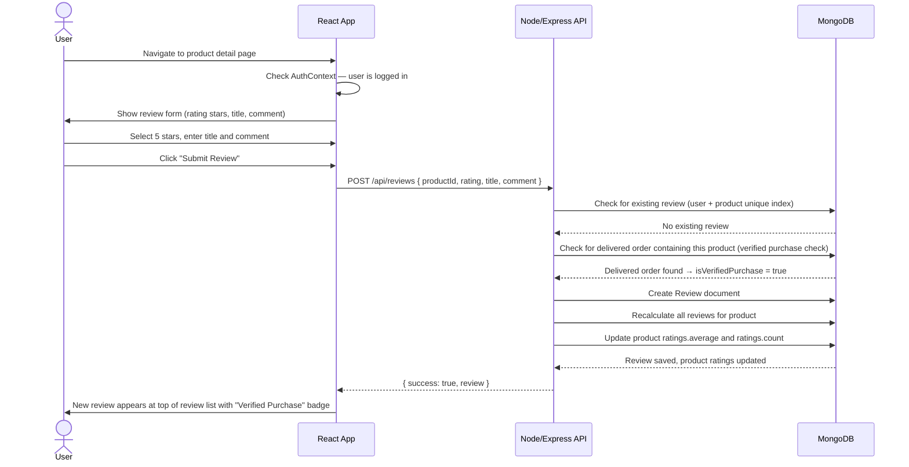

# User Flows

This document maps out the key user journeys on the **PetPaws** e-commerce platform using sequence diagrams — covering the complete checkout lifecycle, order tracking, and administrator order management.

---

## 1. Customer Checkout Flow

This diagram outlines the complete sequence from a user adding a pet product to the cart through to successful order confirmation.

---

## 2. User Registration & Login Flow

---

## 3. Order Tracking Flow (Customer)

---

## 4. Admin Order Management Flow

---

## 5. Admin Product Creation Flow

---

## 6. Product Review Submission Flow

---

[◄ Back to Project Architecture](../project_architecture.md) | [Back to Home](../README.md)
